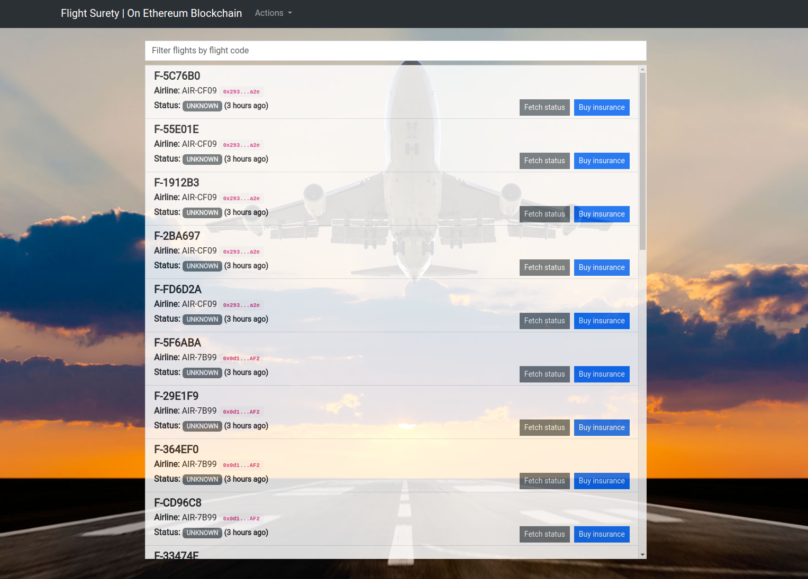
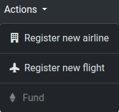
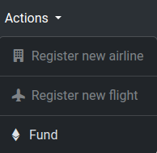
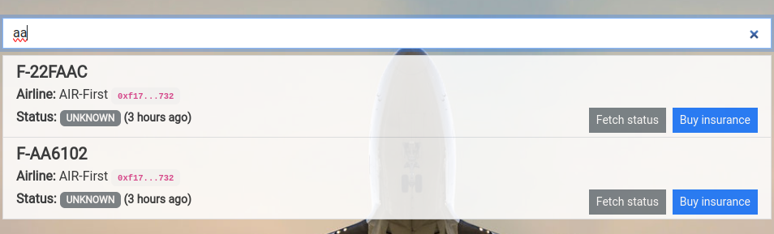
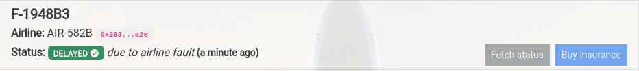
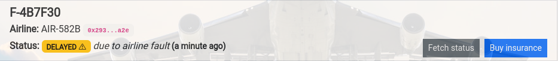
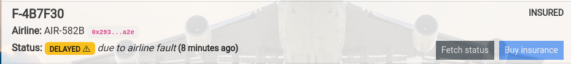
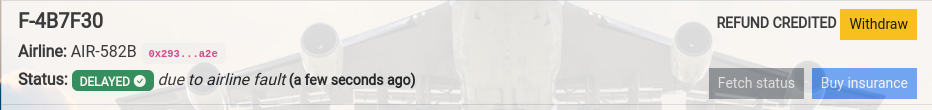
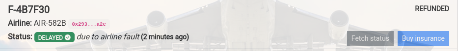

# Udacity | Blockchain Developer nano-degree | Project 4 | Flight Surety Project
- [Udacity | Blockchain Developer nano-degree | Project 4 | Flight Surety Project](#udacity--blockchain-developer-nano-degree--project-4--flight-surety-project)
  - [Installation](#installation)
  - [Testing](#testing)
  - [Configuration](#configuration)
    - [Ganache](#ganache)
    - [Contract migration](#contract-migration)
    - [Data provision](#data-provision)
  - [Run the Dapp](#run-the-dapp)
    - [Oracles](#oracles)
    - [DApp](#dapp)
  - [Usage](#usage)
    - [General](#general)
      - [Actions menu](#actions-menu)
      - [Filter flights' list](#filter-flights-list)
      - [Flights' list](#flights-list)
        - [Fetch status button](#fetch-status-button)
        - [Buy insurance button](#buy-insurance-button)
        - [Withdraw refund button](#withdraw-refund-button)

This project is an Ethereum DApp that implements a Flight Surety flow among airlines and passengers. The airlines manage the registration of new airlines and flights while passengers can opt for a flight insurance. The status of a flight is fetched via oracles and the passengeres get refunded in case of a flight delay caused by its airline.

## Installation

> **NOTE**: make sure to use the below truffle environment
> ```
> ⟩ truffle version
> Truffle v5.11.5 (core: 5.11.5)
> Ganache v7.9.1
> Solidity - 0.7.6 (solc-js)
> Node v18.18.1
> Web3.js v1.10.0
> ```

Then install the dependencies
```
npm install
```

## Testing
You can run the contract tests with:
```
truffle test
```

## Configuration
Below are the required steps before start using the DApp.

### Ganache
Start Ganache using the provided script:
```
chmod +x ganache.sh
./ganache.sh
```
It will generate 100 accounts with 1000 ETH each.

### Contract migration
Migrate the contracts with:
```
truffle migrate --reset
```

### Data provision
Provision the contract with some data like airlines, flights and oracles with:

```
npm run provision
```
It will output the registered addresses of the airlines and the oracles.

The address with index `0` is used for the contract owner, the addresses with indexes `1-6` are used for the airlines and the addresses `20-40` are used for the oracles.

Additionally, this script will take care of the granting access of the data contract to the app contract.

> **WARNING**: In case you encounter `"out of gas"` errors, you can just re-run the script. You'll then notice `"... is already registered"` errors but that's expected.

## Run the Dapp

### Oracles
Start the oracles script with:
```
npm run oracles
```
It will keep monitoring for flight status request events and the suitable oracles will submit responses.

### DApp
In a separate terminal start the DApp with:
```
npm run dapp
```
and then point your browser to [http://localhost:8080/](http://localhost:8080/)

## Usage
> **NOTE**: The DApp is designed to work along with [Metamask](https://metamask.io/). That means that the relevant extension has to be installed in your browser and connected to your local Ganache provider (typically [http://localhost:8545](http://localhost:8545)).
>
> That means of course that you'll have to sign all the involved transactions i.e. fetching flight status, buying insurances etc.
>
> Additionally, in order to explore the DApp in its full extent some accounts should be imported in Metamask. Feel free to use the below ones:
>
> - First Airline (index: 1): `0xf17f52151EbEF6C7334FAD080c5704D77216b732`
> - Second Airline (index: 2): `0xC5fdf4076b8F3A5357c5E395ab970B5B54098Fef`
> - Passenger (index 11): `0x69e1CB5cFcA8A311586e3406ed0301C06fb839a2`
>
> The the available addresses (included the above ones) along with their respective private keys can be found either upon starting Ganache or in the included text file: `ganache-accounts.txt`.

### General
The DApp is a Single Page Application and it looks like below:



Below are described the different sections of the DApp from top to bottom.

#### Actions menu
This section is visible **ONLY** to Airline accounts. The available options are:
- Register new airline
- Register new flight
- Fund

The first two options are available only to contributing airlines, i.e. airlines that have submitted the necessary funding.



The last option is only available to airlines that have been registered but have not submitted the necessary funding yet.




#### Filter flights' list
At the top of the flights' list there is a search bar which can be used to filter the flights based on their name. It can be handy when the list grows big.

>**NOTE**: the filter is case insensitive



#### Flights' list
The main part of the page is the list of the flights. In a flight item the following information can be found:
- Flight code
- Airline name
- Airline account address
- Current status
- Last update

Moreover, there are two buttons: [Fetch status button](#fetch-status-button) and [Buy insurance button](#buy-insurance-button).

##### Fetch status button
This button initiates a request to the contract for the current status of the flights. The request will be forwarded to the oracles which will provide the response. Upon receiving the response the status of the status will be updated.

If the status is verified (i.e. it is confirmed by 3 oracles) the status will turn green:




If the status is **not** verified it will turn yellow:




> **NOTE**: If the status is verified then the buttons will be disabled as they will not be of any use anymore.

> **NOTE**: Keep in mind that the status might change more that once upon a single request. That can happen due to a delayed event received from the DApp.

> **NOTE**: In order to serve the purpose of this project in a more obvious way the probabilities of the statuses are not uniform. More specifically a delayed status due to the airline's fault has 30% higher change to happen. That way the user will be able to observe more frequently the whole insurance flow (buy insurance, get refund credit, withdraw refund) of the DApp

##### Buy insurance button
Any account (typically a passenger) can be insured for a flight whose status has not been verified yet. After the purchase a relevant tag `INSURED` will appear on the right-top corner of the flight area:



##### Withdraw refund button
When the status of a flight is verified to be delayed due to an airline's fault and the current account has been insured for the specific flight then a tag `REFUND CREDITED` along with a `Withdraw` button will appear in the right-top corner:



Upon clicking on the button and completing the withdraw transaction the tag will turn into `REFUNDED`:


